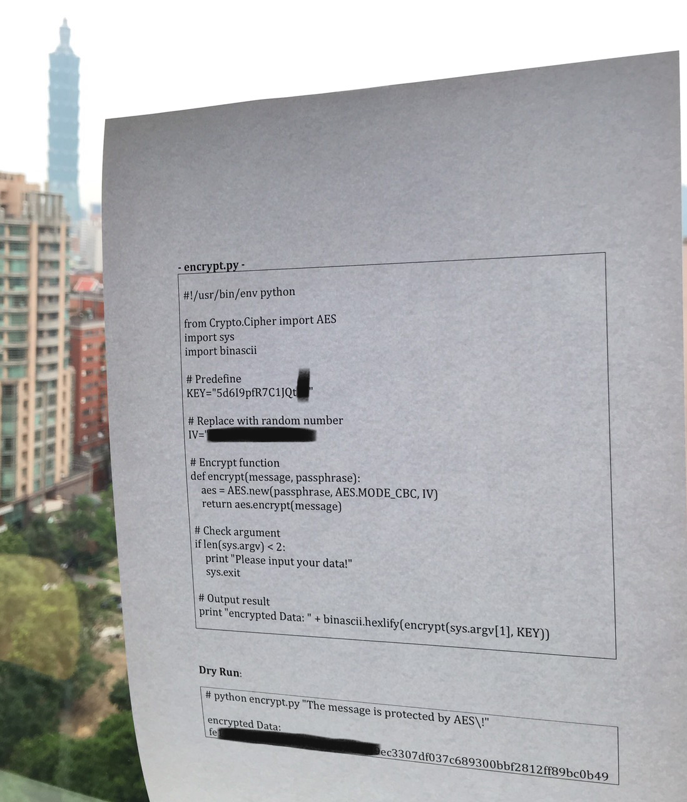

# Trend Micro CTF 2015: crypto200

----------
## Challenge details
| Contest        | Challenge     | Category  | Points |
|:---------------|:--------------|:----------|-------:|
| Trend Micro CTF 2015 | crypto200 | Crypto |    200 |

**Description:**
>*Category: Cryptography*
>
>*Points: 200*
>
>*Zip Password: image_q*
>
>*Your small program has been drew by kid, some values are missed, but you feel you can restore it!

>
>*Please try to find the value of AES IV key.*



-------------

## Solution

观察图片， 我们丢失了以下信息：

- IV
- 秘钥的最后两个字节
- 几乎前32 bits 的密文 （one block）

同时， 我们得到的信息：

- CBC mode 
- 最后一个block的密文
- plain text


我们知道， CBC 解密的时候依赖上一个block的密文以及秘钥。 
第一个block的密文是
    
    fe............................c3
    
显然， 如果我们使用正确的秘钥， 配合这段残缺的密文是可以解出第二个block的第一个字节和最后一个字节的。

于是开始搜索出正确的秘钥  

```python
#! python3
from Crypto.Cipher import AES
import string
from itertools import combinations_with_replacement
from binascii import hexlify, unhexlify


# use 0 to replace unknown bits
raw_ct = unhexlify('fe' + '0'*28 + 'c3' + '307df037c689300bbf2812ff89bc0b49')
raw_iv = '0'*16

pt = 'The message is protected by AES!'
key_prefix = '5d6I9pfR7C1JQt'

def recover_key():

    for guess in combinations_with_replacement(string.printable, 2):
        guess = ''.join(guess)
        key = key_prefix + guess
        decry_pt = AES.new(key, mode=AES.MODE_CBC, IV=raw_iv).decrypt(raw_ct)
        
        
        if decry_pt[16] == ord('r') and decry_pt[31] == ord('!'):
            return key

```


得到秘钥`5d6I9pfR7C1JQt7$1`

-----

接下来需要解出第一个block的ct，   
推导

```
dec(key, second_block_ct) ^ wrong_first_block_ct = wrong_second_block_pt
dec(key, second_block_ct) ^ right_first_block_ct = right_second_block_pt

=>

right_first_block_ct = wrong_second_block_pt ^ right_second_block_pt ^ wrong_first_block_ct
```


```python
def xor_bytes(a,b):
    return bytes([i^j for i,j in zip(a,b)])

def recover_ct(key):
    right_pt = pt.encode()
    wrong_ct = raw_ct
    
    wrong_pt = AES.new(key, mode=AES.MODE_CBC, IV=raw_iv).decrypt(raw_ct)
    #                                                 
    right_first_ct = xor_bytes(wrong_pt[16:], xor_bytes(right_pt[16:], wrong_ct[:16]))
    return right_first_ct + raw_ct[16:]
    ```

检测一下输出的hex结果

```python
print(hexlify(recover_ct('5d6I9pfR7C1JQt7$')))

#output b'fe1199011d45c87d10e9e842c1949ec3307df037c689300bbf2812ff89bc0b49'
```

解iv和解第一个ct的思路是一样的

不重复了。  

最后的程序  

```python
#! python3
from Crypto.Cipher import AES
import string
from itertools import combinations_with_replacement
from binascii import hexlify, unhexlify


# use 0 to replace the unknown info
raw_ct = unhexlify('fe' + '0'*28 + 'c3' + '307df037c689300bbf2812ff89bc0b49')
raw_iv = '0'*16

pt = 'The message is protected by AES!'
key_prefix = '5d6I9pfR7C1JQt'

def recover_key():

    for guess in combinations_with_replacement(string.printable, 2):
        guess = ''.join(guess)
        key = key_prefix + guess
        decry_pt = AES.new(key, mode=AES.MODE_CBC, IV=raw_iv).decrypt(raw_ct)
        
        
        if decry_pt[16] == ord('r') and decry_pt[31] == ord('!'):
            return key

        

def xor_bytes(a,b):
    return bytes([i^j for i,j in zip(a,b)])


def recover_ct(key):
    right_pt = pt.encode()
    wrong_ct = raw_ct
    
    wrong_pt = AES.new(key, mode=AES.MODE_CBC, IV=raw_iv).decrypt(raw_ct)
    #                                                 
    right_first_ct = xor_bytes(wrong_pt[16:], xor_bytes(right_pt[16:], wrong_ct[:16]))
    return right_first_ct + raw_ct[16:]
    

def recover_iv(ct, key):
    right_pt = pt.encode()
    wrong_iv = raw_iv.encode()
    
    wrong_pt = AES.new(key, mode=AES.MODE_CBC, IV=wrong_iv).decrypt(ct)
    #                                                 
    right_iv = xor_bytes(wrong_pt[:16], xor_bytes(right_pt[:16], wrong_iv))
    return right_iv.decode()
    
    
key = recover_key()
ct = recover_ct(key)
print(recover_iv(ct, key))
```

输出 `Key:rVFvN9KLeYr6`

    


